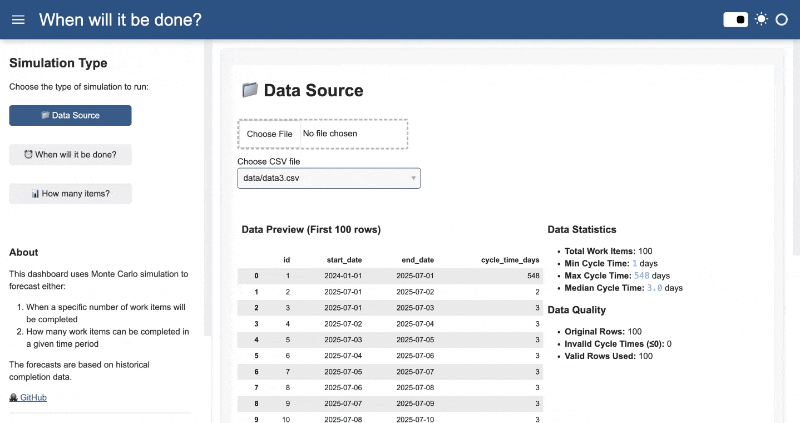

[🇬🇧 English](README.md) | [🇧🇷 Português](README-pt-br.md)

[](https://github.com/rodbv/kwando/actions/workflows/test.yml)


# KWANDO: Dashboard de Simulação Monte Carlo

Dashboard para prever a conclusão de itens de trabalho usando simulações Monte Carlo. Feito com Python e [Panel](https://panel.holoviz.org/).



## Por que Simulação Monte Carlo?

Simulações Monte Carlo usam os dados históricos reais do seu time para gerar milhares de possíveis cenários futuros, mostrando uma faixa de resultados prováveis e suas probabilidades. Diferente de médias simples ou cálculos de throughput, a abordagem Monte Carlo leva em conta a variabilidade natural e a imprevisibilidade do trabalho real. Assim, você obtém previsões com níveis de confiança (percentis), e não apenas um único número, ajudando a tomar decisões melhores diante da incerteza.

Para saber mais, veja o livro [Actionable Agile Metrics for Predictability: An Introduction](https://actionableagile.com/books/aamfp/) de Daniel Vacanti.

Assista: [Seu projeto se comporta como um furacão. Faça previsões como um. (YouTube)](https://www.youtube.com/watch?v=j1FTNVRkJYg)

## Primeiros Passos

### Rodar com Docker (sem Python local)

Se você tem Docker instalado, pode construir e rodar o Kwando sem instalar Python ou dependências:

```sh
# Construa a imagem Docker (no diretório raiz do repositório)
docker build -t kwando-dashboard .

# Rode o dashboard, expondo em http://localhost:5006
docker run -p 5006:5006 kwando-dashboard
```

Depois, acesse [http://localhost:5006](http://localhost:5006) no seu navegador.

## Começando

### Pré-requisitos

- Python 3.12 ou superior
- Gerenciador de pacotes [uv](https://docs.astral.sh/uv/getting-started/installation/)

### Instalação

1. Instale o uv:
   ```sh
   curl -LsSf https://astral.sh/uv/install.sh | sh
   ```
2. Clone o repositório:
   ```sh
   git clone https://github.com/rodbv/kwando.git
   cd kwando
   ```
3. Instale as dependências:
   ```sh
   uv sync
   ```
4. Execute o dashboard:
   ```sh
   uv run panel serve src/dashboard.py
   ```
5. Abra seu navegador no URL mostrado no terminal (tipicamente `http://localhost:5006`)

## Formato dos Dados

Seu arquivo CSV deve conter as seguintes colunas:
- `id`: Identificador único para cada item de trabalho
- `start_date`: Data de início no formato ISO 8601 (YYYY-MM-DD)
- `end_date`: Data de conclusão no formato ISO 8601 (YYYY-MM-DD)

Exemplo:

```csv
id,start_date,end_date
1,2024-01-01,2024-01-01
2,2024-01-01,2024-01-02
3,2024-01-01,2024-01-03
```

## Como Usar

1. **Carregar Dados**: Use a seção "Fonte de Dados" para carregar seu arquivo CSV ou escolher arquivos existentes
2. **Escolher Análise**:
   - **"Quando será concluído?"**: Calcular data de conclusão para um número específico de itens
   - **"Quantos itens?"**: Calcular quantos itens podem ser concluídos em um período
3. **Ajustar Parâmetros**: Definir número de itens ou período de datas
4. **Ver Resultados**: Ver percentis e níveis de confiança da previsão

---

## Contribuindo

Contribuições são bem-vindas! Veja o [Guia de Contribuição](CONTRIBUTING.md) para detalhes sobre como enviar issues, sugestões e pull requests.

## Código de Conduta

Este projeto segue um [Código de Conduta](CODE_OF_CONDUCT.md). Ao participar, espera-se que você siga este código.

## Licença

Licença MIT - veja o arquivo [LICENSE](LICENSE) para detalhes.

## Créditos

- Simulação Monte Carlo adaptada de [rueedlinger/monte-carlo-simulation](https://github.com/rueedlinger/monte-carlo-simulation)
- Inspirado no livro [Actionable Agile Metrics for Predictability: An Introduction](https://actionableagile.com/books/aamfp/) de Daniel Vacanti
